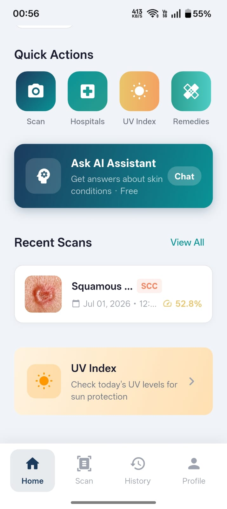
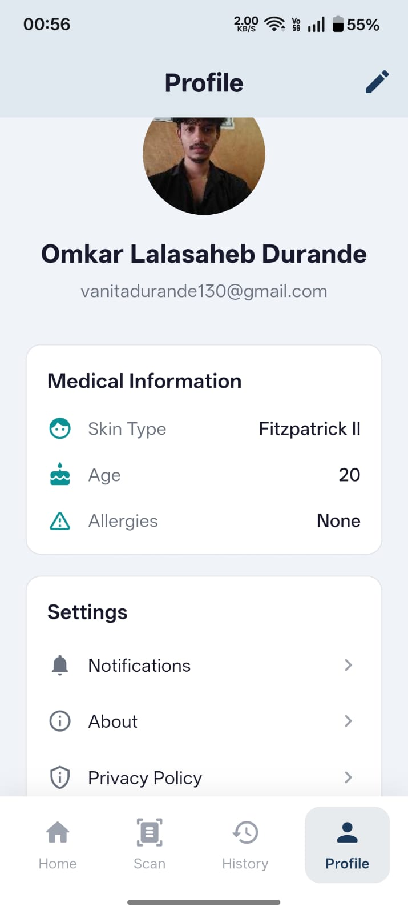
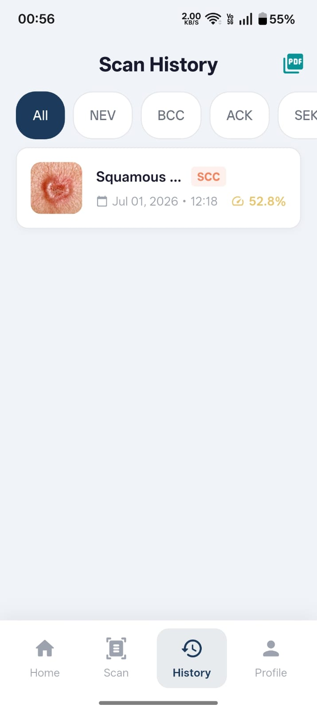
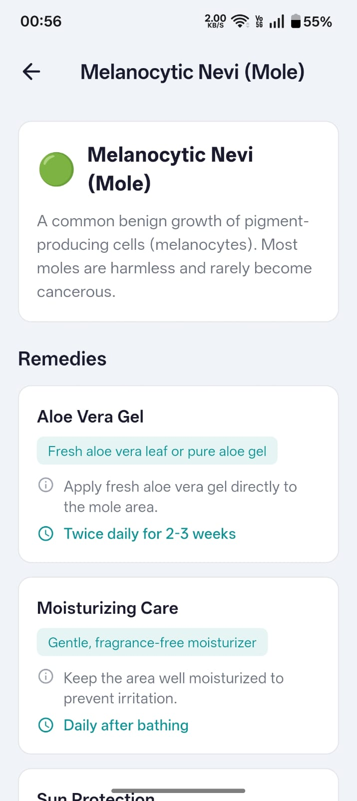
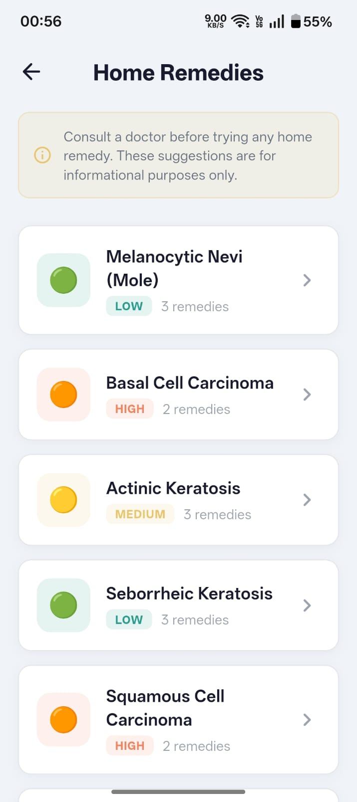

<div align="center">

# 🩺 DermaScan AI

**AI-powered skin disease detection — Flutter app + FastAPI backend**

[](https://flutter.dev/)
[](https://fastapi.tiangolo.com/)
[](https://pytorch.org/)
[](https://firebase.google.com/)
[](https://huggingface.co/spaces/omkardurande/dermascan-api)
[](LICENSE)

*Snap a photo → get an AI diagnosis → find a nearby hospital, all in seconds.*

</div>

---

## 📱 App Screenshots

<p align="center">
  
  
  
  
  
</p>

| Nearby Hospitals (List) | UV Exposure | Hospitals Map | Home Remedies | Remedy Detail |
|:---:|:---:|:---:|:---:|:---:|
| 64 hospitals & clinics nearby | Live UV index + sun advice | Interactive OpenStreetMap | Severity-tagged remedies | Step-by-step instructions |

---

## 📌 Overview

**DermaScan AI** is a full-stack mobile health application that uses deep learning to classify skin lesions from dermoscopic images. The system combines a **Flutter mobile app** (Android/iOS) with a **FastAPI backend** running an **EfficientNet-B3** model trained on the clinical **PAD-UFES-20** dataset.

> ⚕️ **Medical Disclaimer:** This tool is for educational and research purposes only. It is **not** a substitute for professional medical diagnosis.

---

## ✨ Features

### 📱 Mobile App (Flutter)
| Feature | Description |
|---|---|
| 📷 **AI Skin Scan** | Camera / gallery capture → real-time AI classification |
| 🔐 **Authentication** | Firebase Auth with OTP phone verification & email |
| 🏥 **Nearby Hospitals** | Interactive map + list of hospitals & clinics by distance |
| 🌞 **UV Exposure** | Live UV index, protection advice & best outdoor times |
| 💊 **Home Remedies** | Condition-specific remedy suggestions with severity tags |
| 🤖 **AI Chat** | Gemini-powered dermatology assistant chatbot |
| 📋 **Scan History** | Chronological log of all scans with confidence scores |
| 📄 **PDF Export** | Generate and share medical report PDFs |
| 📶 **Offline Mode** | Offline banner + graceful degradation |

### ⚙️ Backend (FastAPI)
| Feature | Description |
|---|---|
| 🔬 **AI Inference** | EfficientNet-B3 classifies 6 skin lesion types |
| ⚡ **Fast Response** | Sub-second prediction with Test-Time Augmentation |
| 🛡️ **OOD Rejection** | Rejects non-skin images via entropy & confidence thresholds |
| 📊 **Scan CRUD** | Save, retrieve & delete user scan records |
| 🐳 **Docker Ready** | One-command deploy on HuggingFace Spaces or any server |
| 📖 **Auto Docs** | Swagger UI at `/docs` and ReDoc at `/redoc` |

---

## 🗂️ Repository Structure

```
DermaScan-AI/
│
├── 📁 dermascan_ai/              # Flutter Mobile App
│   ├── lib/
│   │   ├── main.dart
│   │   ├── screens/
│   │   │   ├── home_screen.dart
│   │   │   ├── scan_screen.dart
│   │   │   ├── results_screen.dart
│   │   │   ├── history_screen.dart
│   │   │   ├── nearby_hospitals_screen.dart
│   │   │   ├── uv_exposure_screen.dart
│   │   │   ├── home_remedies_screen.dart
│   │   │   ├── ai_chat_screen.dart
│   │   │   ├── profile_screen.dart
│   │   │   └── auth/  (login, signup, otp, email verification)
│   │   ├── services/
│   │   │   ├── auth_service.dart
│   │   │   ├── firestore_service.dart
│   │   │   ├── gemini_service.dart
│   │   │   ├── pdf_report_service.dart
│   │   │   ├── connectivity_service.dart
│   │   │   └── image_storage_service.dart
│   │   ├── providers/            # State management (Provider)
│   │   ├── models/               # Data models
│   │   └── widgets/              # Reusable UI components
│   ├── assets/
│   │   ├── images/
│   │   └── animations/           # Lottie animations
│   ├── android/
│   ├── ios/
│   └── pubspec.yaml
│
└── 📁 fastapi_backend/           # Python AI Backend
    ├── main.py                   # FastAPI routes
    ├── model.py                  # EfficientNet-B3 + training pipeline
    ├── app_ui.py                 # Streamlit monitoring dashboard
    ├── upload_hf.py              # HuggingFace Spaces deploy helper
    ├── get_hf_logs.py            # Fetch live HF Space logs
    ├── requirements.txt
    ├── Dockerfile
    └── README.md
```

---

## 🧠 AI Model

### Architecture
```
Input Image (300×300 RGB)
        │
        ▼
┌───────────────────────┐
│   EfficientNet-B3     │  ← ImageNet pre-trained backbone
│   (Feature Extractor) │
└───────────────────────┘
        │
        ▼
┌───────────────────────┐
│   Custom Classifier   │
│   Dropout(0.4)        │
│   Linear → 512        │
│   SiLU + BatchNorm    │
│   Dropout(0.3)        │
│   Linear → 6 classes  │
└───────────────────────┘
        │
        ▼
  Softmax + OOD Gate
```

### Supported Disease Classes

| Code | Disease | Severity |
|------|---------|----------|
| `NEV` | Melanocytic Nevi (Mole) | 🟢 Low |
| `BCC` | Basal Cell Carcinoma | 🔴 High |
| `ACK` | Actinic Keratosis | 🟡 Medium |
| `SEK` | Seborrheic Keratosis | 🟢 Low |
| `SCC` | Squamous Cell Carcinoma | 🔴 High |
| `MEL` | Melanoma | 🔴 Critical |

### Training Strategy

| Stage | Epochs | Backbone | LR |
|-------|--------|----------|----|
| Warmup | 6 | Frozen | `1e-3` |
| Fine-tune | up to 34 | Unfrozen | `1e-4` → `1e-6` cosine |

**Techniques:** Focal Loss · Weighted Sampler · Label Smoothing · TTA · Early Stopping · Gradient Clipping

---

## 🚀 Getting Started

### Flutter App

**Prerequisites:** Flutter SDK 3.x, Android Studio / Xcode, Firebase project

```bash
# Clone the repo
git clone https://github.com/omkar-durande/DermaScan-AI.git
cd DermaScan-AI/dermascan_ai

# Install dependencies
flutter pub get

# Configure Firebase
# → Add your google-services.json (Android) and GoogleService-Info.plist (iOS)

# Run the app
flutter run
```

> Update `lib/constants/api_constants.dart` with your backend URL.

---

### FastAPI Backend

**Prerequisites:** Python 3.11+, `skin_model.pth` weights

```bash
cd DermaScan-AI/fastapi_backend

python -m venv venv && source venv/bin/activate
pip install -r requirements.txt

# Place skin_model.pth in this folder, then:
uvicorn main:app --host 0.0.0.0 --port 8000 --reload
```

Visit **http://localhost:8000/docs** for the interactive API explorer.

---

### Docker (Backend)

```bash
cd fastapi_backend
docker build -t dermascan-api .
docker run -p 7860:7860 dermascan-api
```

---

## 📡 API Reference

| Method | Endpoint | Description |
|--------|----------|-------------|
| `GET` | `/health` | Server & model health check |
| `GET` | `/classes` | List all supported disease classes |
| `POST` | `/predict` | Upload image → get AI prediction |
| `POST` | `/scans` | Save a scan record |
| `GET` | `/scans/{user_id}` | Get scan history for a user |
| `DELETE` | `/scans/{scan_id}` | Delete a scan record |

**`POST /predict` Response Example:**
```json
{
  "success": true,
  "prediction": {
    "class": "BCC",
    "full_name": "Basal Cell Carcinoma",
    "confidence": 0.873,
    "severity": "high",
    "all_scores": { "NEV": 0.04, "BCC": 0.87, "ACK": 0.03, "SEK": 0.02, "SCC": 0.02, "MEL": 0.02 }
  },
  "inference_time_ms": 312.5
}
```

---

## 🛠️ Tech Stack

### Mobile (Flutter)
| Package | Purpose |
|---------|---------|
| `firebase_auth` + `cloud_firestore` | Auth & database |
| `http` | REST API calls to backend |
| `image_picker` + `camera` | Image capture |
| `flutter_map` + `geolocator` | Hospital map |
| `provider` | State management |
| `pdf` + `printing` | PDF report export |
| `lottie` | Animations |
| `fl_chart` | Confidence charts |

### Backend (Python)
| Package | Purpose |
|---------|---------|
| `fastapi` + `uvicorn` | API server |
| `torch` + `torchvision` | Deep learning |
| `Pillow` | Image processing |

---

## ⚙️ Configuration

### Backend Environment Variables
| Variable | Default | Description |
|---|---|---|
| `MODEL_PATH` | `skin_model.pth` | Path to model weights |
| `DEVICE` | `cpu` | `cpu` or `cuda` |

### Flutter API Endpoint
Edit `dermascan_ai/lib/constants/api_constants.dart`:
```dart
const String baseUrl = 'https://your-backend-url.com';
```

---

## 🤝 Contributing

1. Fork the repo
2. Create a branch: `git checkout -b feature/your-feature`
3. Commit: `git commit -m "Add your feature"`
4. Push: `git push origin feature/your-feature`
5. Open a Pull Request

---

## 📄 License

MIT License — see [LICENSE](LICENSE) for details.

---

## 🙏 Acknowledgements

- **[PAD-UFES-20](https://data.mendeley.com/datasets/zr7vgbcyr2/1)** — Patricio et al., 2020
- **[EfficientNet](https://arxiv.org/abs/1905.11946)** — Tan & Le, Google Brain
- **[FastAPI](https://fastapi.tiangolo.com/)** · **[Flutter](https://flutter.dev/)** · **[Firebase](https://firebase.google.com/)** · **[HuggingFace Spaces](https://huggingface.co/spaces)**

---

<div align="center">

Made with ❤️ by [Omkar Durande](https://github.com/omkar-durande)

⭐ **Star this repo if you find it useful!**

</div>
